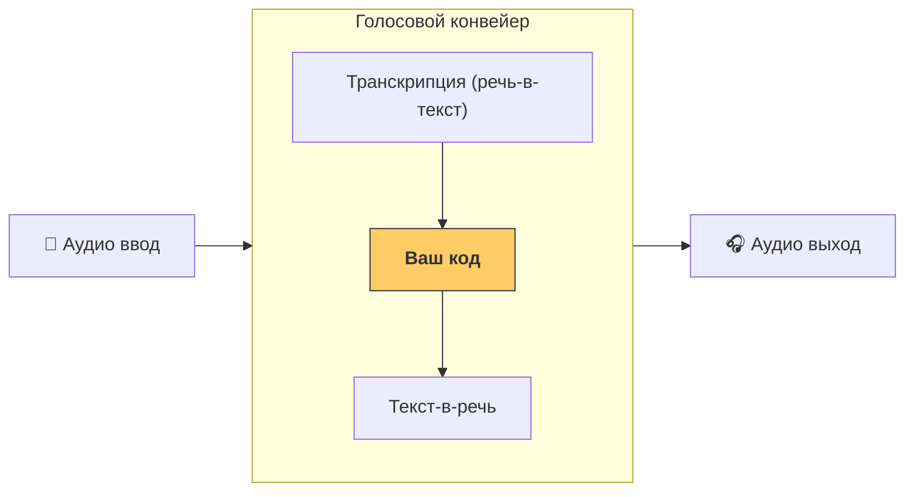

# Конвейеры и рабочие процессы

[`VoicePipeline`][cai.sdk.agents.voice.pipeline.VoicePipeline] — это класс, который упрощает превращение ваших рабочих процессов с агентами в голосовое приложение. Вы передаете рабочий процесс для запуска, а конвейер берет на себя транскрипцию входного аудио, определение окончания аудио, вызов вашего рабочего процесса в нужное время и превращение вывода рабочего процесса обратно в аудио.



## Настройка конвейера

При создании конвейера вы можете настроить несколько параметров:

1. [`workflow`][cai.sdk.agents.voice.workflow.VoiceWorkflowBase] — код, который запускается каждый раз при транскрипции нового аудио.
2. Модели [`speech-to-text`][cai.sdk.agents.voice.model.STTModel] и [`text-to-speech`][cai.sdk.agents.voice.model.TTSModel], используемые для преобразования.
3. [`config`][cai.sdk.agents.voice.pipeline_config.VoicePipelineConfig], который позволяет настроить такие параметры, как:
    - Провайдер моделей, который может сопоставлять имена моделей с моделями.
    - Трассировка, включая возможность отключения трассировки, загрузку аудиофайлов, имя рабочего процесса, ID трассировки и т.д.
    - Настройки моделей TTS и STT, такие как промпт, язык и используемые типы данных.

## Запуск конвейера

Вы можете запустить конвейер с помощью метода [`run()`][cai.sdk.agents.voice.pipeline.VoicePipeline.run], который позволяет передавать аудио ввод в двух формах:

1. [`AudioInput`][cai.sdk.agents.voice.input.AudioInput] используется, когда у вас есть полная аудио транскрипция и вы просто хотите получить результат. Это полезно в случаях, когда вам не нужно определять, когда говорящий закончил говорить; например, когда у вас есть предварительно записанное аудио или в приложениях push-to-talk, где ясно, когда пользователь закончил говорить.
2. [`StreamedAudioInput`][cai.sdk.agents.voice.input.StreamedAudioInput] используется, когда вам может потребоваться определить, когда пользователь закончил говорить. Он позволяет отправлять аудио блоки по мере их обнаружения, и голосовой конвейер автоматически запустит рабочий процесс агента в нужное время через процесс, называемый "детекция активности".

## Результаты

Результат запуска голосового конвейера — это [`StreamedAudioResult`][cai.sdk.agents.voice.result.StreamedAudioResult]. Это объект, который позволяет стримить события по мере их возникновения. Существует несколько типов [`VoiceStreamEvent`][cai.sdk.agents.voice.events.VoiceStreamEvent], включая:

1. [`VoiceStreamEventAudio`][cai.sdk.agents.voice.events.VoiceStreamEventAudio], который содержит блок аудио.
2. [`VoiceStreamEventLifecycle`][cai.sdk.agents.voice.events.VoiceStreamEventLifecycle], который информирует о событиях жизненного цикла, таких как начало или окончание хода.
3. [`VoiceStreamEventError`][cai.sdk.agents.voice.events.VoiceStreamEventError] — событие ошибки.

```python

result = await pipeline.run(input)

async for event in result.stream():
    if event.type == "voice_stream_event_audio":
        # воспроизвести аудио
    elif event.type == "voice_stream_event_lifecycle":
        # жизненный цикл
    elif event.type == "voice_stream_event_error"
        # ошибка
    ...
```

## Лучшие практики

### Прерывания

Agents SDK в настоящее время не поддерживает встроенную поддержку прерываний для [`StreamedAudioInput`][cai.sdk.agents.voice.input.StreamedAudioInput]. Вместо этого для каждого обнаруженного хода будет запускаться отдельный запуск вашего рабочего процесса. Если вы хотите обрабатывать прерывания внутри вашего приложения, вы можете слушать события [`VoiceStreamEventLifecycle`][cai.sdk.agents.voice.events.VoiceStreamEventLifecycle]. `turn_started` укажет, что новый ход был транскрибирован и обработка начинается. `turn_ended` будет запущен после того, как все аудио было отправлено для соответствующего хода. Вы можете использовать эти события для отключения микрофона говорящего, когда модель начинает ход, и включения его после того, как вы очистили все связанное аудио для хода.
