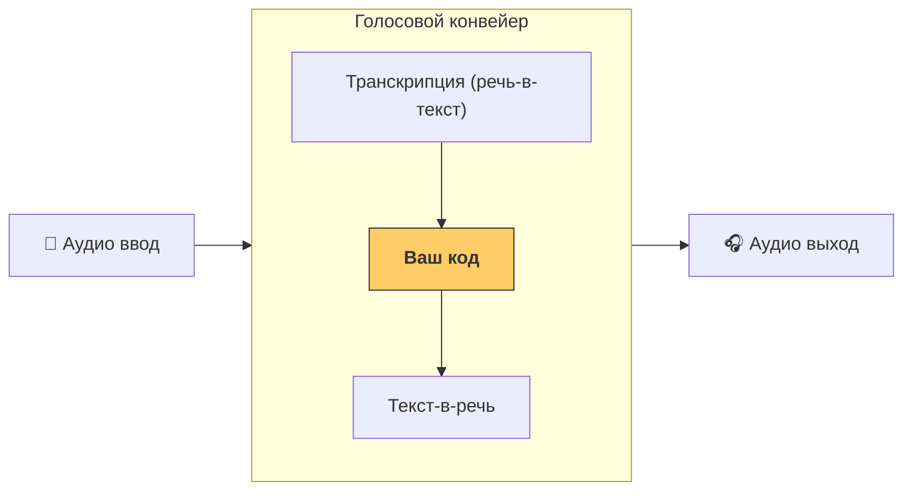

# Быстрый старт

## Предварительные требования

Убедитесь, что вы следуете базовым [инструкциям по быстрому старту](../quickstart.md) для Agents SDK и настроили виртуальное окружение. Затем установите дополнительные голосовые зависимости из SDK:

```bash
pip install 'openai-agents[voice]'
```

## Концепции

Основная концепция, которую стоит знать — это [`VoicePipeline`][cai.sdk.agents.voice.pipeline.VoicePipeline], который представляет собой 3-шаговый процесс:

1. Запуск модели преобразования речи в текст для превращения аудио в текст.
2. Запуск вашего кода, который обычно является рабочим процессом с агентами, для получения результата.
3. Запуск модели преобразования текста в речь для превращения текста результата обратно в аудио.



## Агенты

Сначала давайте настроим несколько Агентов. Это должно быть вам знакомо, если вы создавали агентов с этим SDK. У нас будет несколько Агентов, передача управления и инструмент.

```python
import asyncio
import random

from cai.sdk.agents import (
    Agent,
    function_tool,
)
from agents.extensions.handoff_prompt import prompt_with_handoff_instructions


@function_tool
def get_weather(city: str) -> str:
    """Получить погоду для указанного города."""
    print(f"[debug] get_weather вызван для города: {city}")
    choices = ["солнечно", "облачно", "дождливо", "снежно"]
    return f"Погода в {city} — {random.choice(choices)}."


spanish_agent = Agent(
    name="Spanish",
    handoff_description="Агент, говорящий по-испански.",
    instructions=prompt_with_handoff_instructions(
        "Вы разговариваете с человеком, поэтому будьте вежливы и лаконичны. Говорите по-испански.",
    ),
    model="gpt-4o-mini",
)

agent = Agent(
    name="Assistant",
    instructions=prompt_with_handoff_instructions(
        "Вы разговариваете с человеком, поэтому будьте вежливы и лаконичны. Если пользователь говорит по-испански, передайте управление испанскому агенту.",
    ),
    model="gpt-4o-mini",
    handoffs=[spanish_agent],
    tools=[get_weather],
)
```

## Голосовой конвейер

Мы настроим простой голосовой конвейер, используя [`SingleAgentVoiceWorkflow`][cai.sdk.agents.voice.workflow.SingleAgentVoiceWorkflow] в качестве рабочего процесса.

```python
from agents.voice import SingleAgentVoiceWorkflow, VoicePipeline
pipeline = VoicePipeline(workflow=SingleAgentVoiceWorkflow(agent))
```

## Запуск конвейера

```python
import numpy as np
import sounddevice as sd
from agents.voice import AudioInput

# Для простоты мы просто создадим 3 секунды тишины
# В реальности вы бы получали данные с микрофона
buffer = np.zeros(24000 * 3, dtype=np.int16)
audio_input = AudioInput(buffer=buffer)

result = await pipeline.run(audio_input)

# Создайте аудиоплеер с помощью `sounddevice`
player = sd.OutputStream(samplerate=24000, channels=1, dtype=np.int16)
player.start()

# Воспроизводите аудиопоток по мере его поступления
async for event in result.stream():
    if event.type == "voice_stream_event_audio":
        player.write(event.data)

```

## Соберем все вместе

```python
import asyncio
import random

import numpy as np
import sounddevice as sd

from cai.sdk.agents import (
    Agent,
    function_tool,
    set_tracing_disabled,
)
from agents.voice import (
    AudioInput,
    SingleAgentVoiceWorkflow,
    VoicePipeline,
)
from agents.extensions.handoff_prompt import prompt_with_handoff_instructions


@function_tool
def get_weather(city: str) -> str:
    """Получить погоду для указанного города."""
    print(f"[debug] get_weather вызван для города: {city}")
    choices = ["солнечно", "облачно", "дождливо", "снежно"]
    return f"Погода в {city} — {random.choice(choices)}."


spanish_agent = Agent(
    name="Spanish",
    handoff_description="Агент, говорящий по-испански.",
    instructions=prompt_with_handoff_instructions(
        "Вы разговариваете с человеком, поэтому будьте вежливы и лаконичны. Говорите по-испански.",
    ),
    model="gpt-4o-mini",
)

agent = Agent(
    name="Assistant",
    instructions=prompt_with_handoff_instructions(
        "Вы разговариваете с человеком, поэтому будьте вежливы и лаконичны. Если пользователь говорит по-испански, передайте управление испанскому агенту.",
    ),
    model="gpt-4o-mini",
    handoffs=[spanish_agent],
    tools=[get_weather],
)


async def main():
    pipeline = VoicePipeline(workflow=SingleAgentVoiceWorkflow(agent))
    buffer = np.zeros(24000 * 3, dtype=np.int16)
    audio_input = AudioInput(buffer=buffer)

    result = await pipeline.run(audio_input)

    # Создайте аудиоплеер с помощью `sounddevice`
    player = sd.OutputStream(samplerate=24000, channels=1, dtype=np.int16)
    player.start()

    # Воспроизводите аудиопоток по мере его поступления
    async for event in result.stream():
        if event.type == "voice_stream_event_audio":
            player.write(event.data)


if __name__ == "__main__":
    asyncio.run(main())
```

Если вы запустите этот пример, агент будет говорить с вами! Ознакомьтесь с примером в [examples/voice/static](https://github.com/openai/openai-agents-python/tree/main/examples/voice/static), чтобы увидеть демо, где вы можете говорить с агентом самостоятельно.
